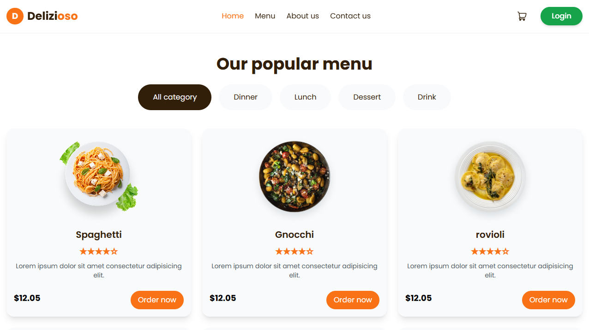

# Restaurant Template 🍽

<p align="center">
  
</p>

<p align="center">
  <a href="https://HamzehEsmaeili.github.io/restaurant-template/">
    <strong>✨ Explore More in Live Demo →</strong>
  </a>
</p>

## 🍕 Introduction

A beautiful, responsive restaurant website template built with modern web technologies. Perfect for any food business looking for an online presence.

## ✨ Key Features

- 📱 Fully responsive (works perfectly on all devices)
- 🎨 Styled with Tailwind CSS for rapid development
- 🍔 Interactive elements with JavaScript

## 🛠 Technologies Used

- 
- 
- 
- 

## 🌐 Live Demo

[](https://HamzehEsmaeili.github.io/restaurant-template/)  
🔗 **URL**: [https://HamzehEsmaeili.github.io/restaurant-template/](https://HamzehEsmaeili.github.io/restaurant-template/)

## 🖥 How to Run

1. Clone the repository:

```bash
git clone https://github.com/HamzehEsmaeili/restaurant-template.git
```
